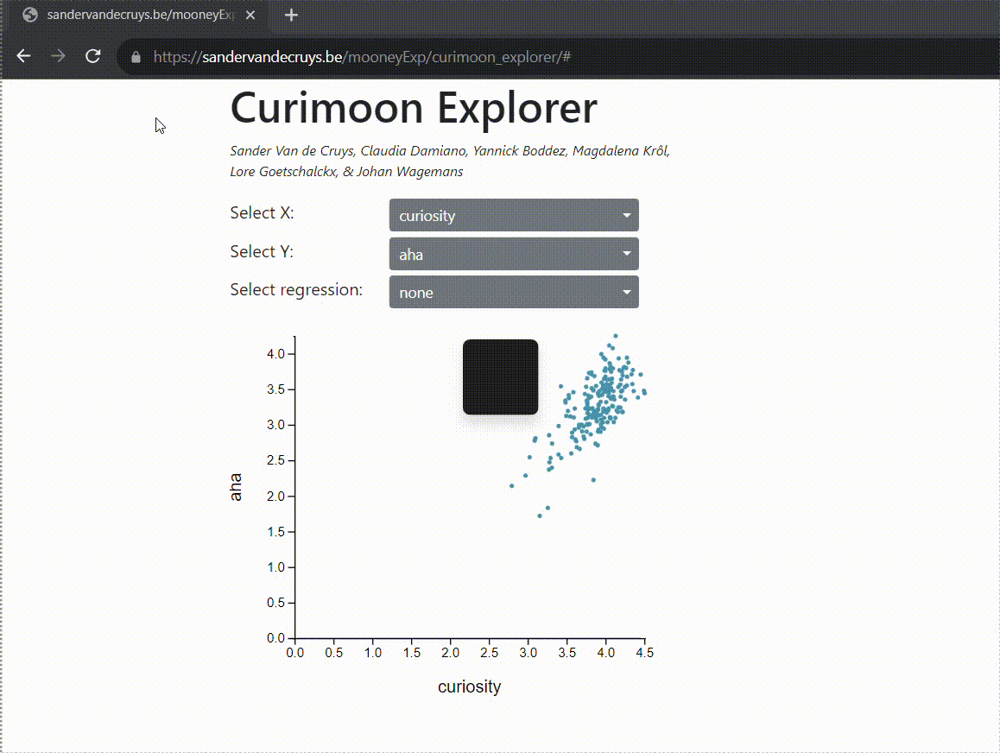

# Curimoon-Explorer
This repo contains the code for an interactive data visualization tool I made for our <a href="https://drive.google.com/file/d/1JTTwxhRW36zMyKNVq9qy5zNZQL6cx5rI/view">paper</a> on linking curiosity, Aha-Erlebnis, and memory through information gain.

The data and Mooney images needed to run it can be found on <a href=https://osf.io/hm2kb/>OSF</a>. Mooney images are two-tone images that often give people the sense that they can 'almost' tell what is depicted, but not quite. However, once the solution is revealed, it is hard to 'unsee' it.

Below is a demo-video, but you can also interact with the data yourself on <a href="https://sandervandecruys.be/mooneyExp/curimoon_explorer/"> this link</a>.





## Citation

```
@article{VandeCruys2021,
  doi = {10.1016/j.cognition.2021.104698},
  url = {https://doi.org/10.1016/j.cognition.2021.104698},
  year = {2021},
  month = jul,
  publisher = {Elsevier {BV}},
  volume = {212},
  pages = {104698},
  author = {Sander Van de Cruys and Claudia Damiano and Yannick Boddez and Magdalena Kr{\'{o}}l and Lore Goetschalckx and Johan Wagemans},
  title = {Visual affects: Linking curiosity,  Aha-Erlebnis,  and memory through information gain},
  journal = {Cognition}
}
```
